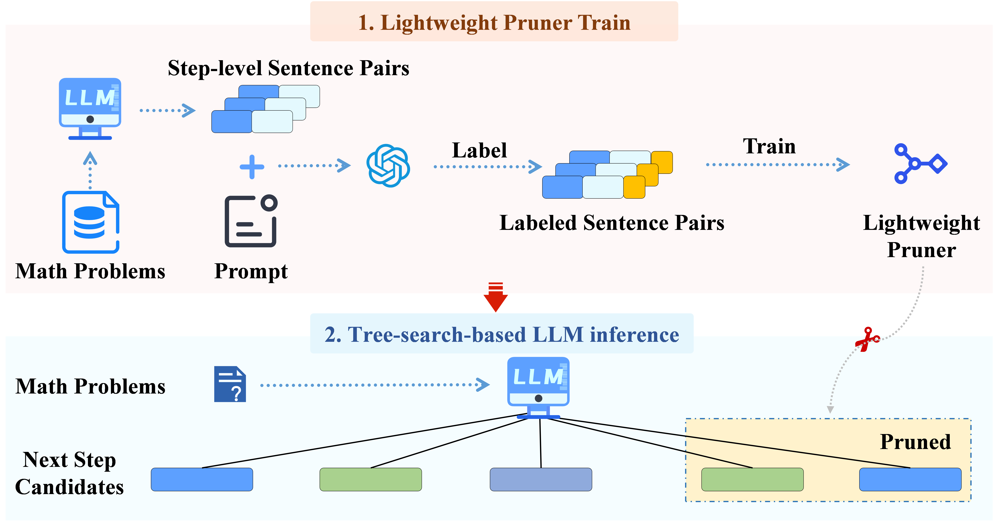
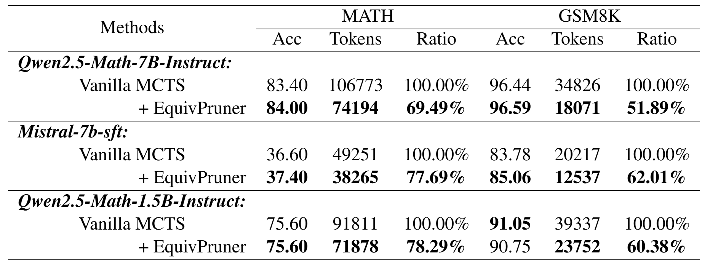

<div align="center">
<h1> EquivPruner: Boosting Efficiency and Quality in LLM-Based Search via Action Pruning</h1> 
</div>

<p align="center">
<a href="https://opensource.org/licenses/Apache-2.0">
  </a> 
<a href="https://github.com/Lolo1222/EquivPruner/pulls">
    </a>
</p>

## Introduction

Large Language Models (LLMs) excel at complex reasoning through search algorithms, yet current strategies often suffer from massive token consumption due to redundant exploration of semantically equivalent steps.

We introduce ***EquivPruner***, a simple yet effective approach that centers on identifying and pruning semantically equivalent actions during LLM reasoning search. We release ***MathEquiv***, the first benchmark dataset specifically designed for mathematical statement equivalence. It serves as a versatile resource applicable to a variety of mathematical tasks and scenarios.

Leveraging this **MathEquiv** dataset, we trained a lightweight yet effective equivalence detection model. This model serves as a dynamic pruner integrated into the LLM's search process. When the LLM generates multiple candidate reasoning steps at a given expansion point, the pruner identifies sets of semantically equivalent candidates among these siblings. For each set of equivalent steps, it retains only a single representative node for further exploration, effectively pruning the redundant branches and significantly reducing the search space.



Our proposed EquivPruner demonstrates compelling improvements across these settings. For instance, when applied to Qwen2.5-Math-7B-Instruct on GSM8K—where the model already achieves a very high baseline accuracy of 96.44\%—EquivPruner not only cuts token consumption by a substantial **48.1%** but also further boosts accuracy to **96.59%**. This demonstrates EquivPruner's ability to significantly enhance searching efficiency.



## MathEquiv Dataset

Our MathEquiv Dataset is available at [MathEquiv](https://huggingface.co/datasets/Jiawei1222/MathEquiv).

It's specifically designed for mathematical statement equivalence , serving as a versatile resource applicable to a variety of mathematical tasks and scenarios.

## Installation

```
conda create -n EquivPruner python=3.10
conda activate EquivPruner 
pip install -r requirements.txt
pip3 install  "fschat[model_worker,webui]"
pip install -U pydantic
cd envs/MATH/latex2sympy
pip install -e .
cd -
```

### Download Base Models

Before running the project, please ensure that all required base models are downloaded. The models used in this project include:

- `Qwen2.5-Math-1.5B-Instruct`, `Qwen2.5-Math-7B-Instruct`
- `peiyi9979/mistral-7b-sft`
- `peiyi9979/math-shepherd-mistral-7b-prm`

To download these models, please refer to the [Hugging Face model downloading tutorial](https://huggingface.co/docs/hub/models-downloading) for step-by-step guidance on downloading models from the Hugging Face Hub.

Ensure that all models are saved in their directories according to the project setup before proceeding.

## Inference Pruning

**1.Start a LLM Service**

Before running inference, please modify the following variables in the `merge/create_service_merge.sh` script to set the appropriate base models for your usage:

- `$MODEL_BASE`: Set this to the directory where your models are stored.
- `$POLICY_MODEL_NAME`: Set this to the name of the policy model you wish to use.
- `$VALUE_MODEL_NAME`: Set this to the name of the value model you wish to use.
- `$MERGE_MODEL_PATH`: Set this to the path of merge model workers to start.
- `$NUM_LM_WORKER`: Set this to the number of language model (LM) workers to start.
- `$NUM_RM_WORKER`: Set this to the number of reward model (RM) workers to start.
- `$NUM_MERGE_WORKER`: Set this to the number of reward model (RM) workers to start.

```
sh merge/create_service_merge.sh
```

> What this scrip does is to run Three separate LLM services on your hardware, for generation ,value and merge inference respectively. 

**2.Run Inference**

> ⚠️**Tips:** Make sure the input (**--LM**, **--RM**) in the script aligns with variable (\$*POLICY_MODEL_NAME*, \$*VALUE_MODEL_NAME*) in the pending worker!

```
sh scripts\qwen_mprm\math\simple_mcts_merge.sh

sh scripts\qwen_mprm\math\simple_mcts_no_merge.sh
```


## Contributing

We warmly welcome contributions and discussions related to EquivPruner! If you have any suggestions for improvements or ideas you'd like to discuss, please don't hesitate to open an issue. This will allow us to collaborate and discuss your ideas in detail.

## Acknowledgments

This codebase is built from [openr](https://github.com/openreasoner/openr) and [TokenSkip](https://github.com/hemingkx/TokenSkip).

## Citation

If you find the resources in this repository useful, please cite our paper:
```
@article{liu2025equivpruner,
  title={EquivPruner: Boosting Efficiency and Quality in LLM-Based Search via Action Pruning},
  author={Jiawei Liu, Qisi Chen, Jianshu Zhang, Quan Liu, Defu Lian},
  journal={arXiv preprint arXiv:2505.16312},
  year={2025}
}
```
